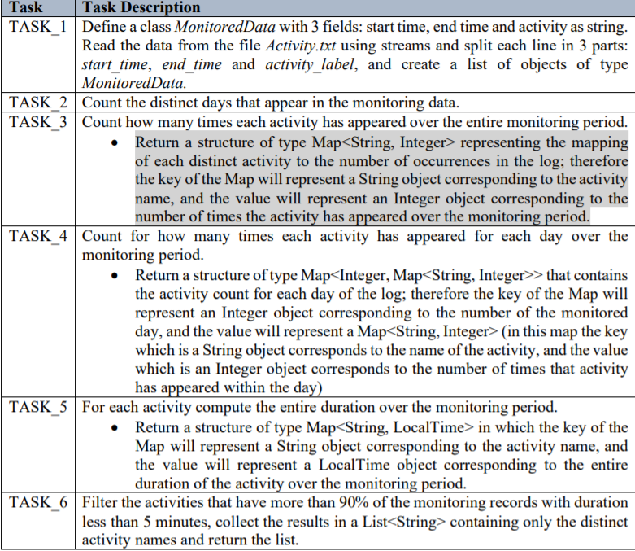

# Processing_Sensor_Data_LambdaExpressions
An application for analysing the behaviour of a
person recorded by a set of sensors installed in its house. The historical log of the person’s activity
is stored as tuples (start_time, end_time, activity_label), where start_time and end_time represent
the date and time when each activity has started and ended while the activity label represents the
type of activity performed by the person: Leaving, Toileting, Showering, Sleeping, Breakfast,
Lunch, Dinner, Snack, Spare_Time/TV, Grooming. The data is spread over several days as many
entries in the log Activities.txt.

The program uses functional programming in Java with lambda expressions and stream
processing to perform the tasks listed in the table below. The results of each task are written
in a separate .txt file.

The results can be viewed in the .txt files
